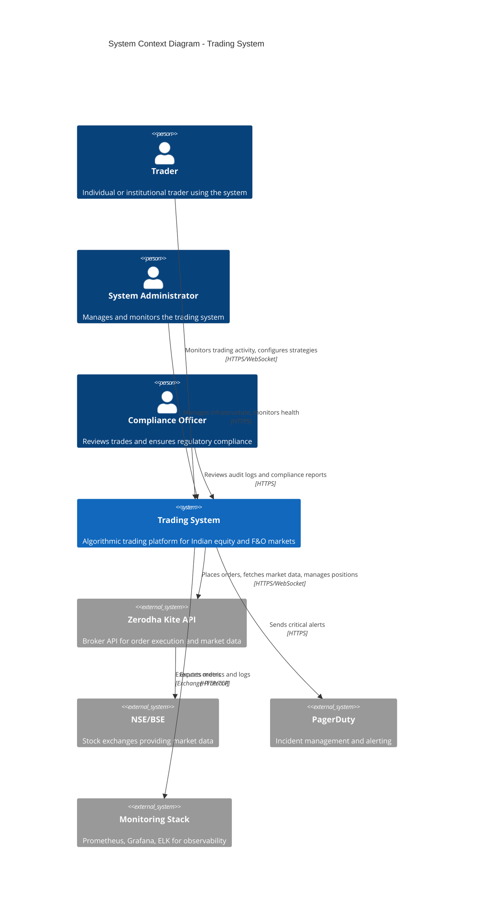

# Trading System - C4 Context Diagram

**Level 1: System Context**

This diagram shows the trading system in the context of its users and external systems.



## System Context Description

### Users

#### Trader
- **Role:** Primary user of the trading system
- **Responsibilities:**
  - Monitor live trading activity
  - Configure trading strategies and parameters
  - Review portfolio performance
  - Analyze backtesting results
- **Interfaces:** Web Dashboard, API

#### System Administrator
- **Role:** Operations and infrastructure management
- **Responsibilities:**
  - Deploy and manage infrastructure
  - Monitor system health
  - Respond to alerts and incidents
  - Manage secrets and configuration
- **Interfaces:** K8s Dashboard, Grafana, Shell Access

#### Compliance Officer
- **Role:** Regulatory compliance and audit
- **Responsibilities:**
  - Review trade logs and audit trails
  - Ensure SEBI compliance
  - Generate regulatory reports
  - Investigate suspicious activity
- **Interfaces:** Compliance Dashboard, Audit Log Viewer

---

### External Systems

#### Zerodha Kite API
- **Purpose:** Primary broker integration for order execution
- **Capabilities:**
  - Market data (live quotes, historical data)
  - Order placement and management
  - Portfolio and position tracking
  - Margin and fund information
- **Protocol:** REST API + WebSocket
- **Rate Limits:** 3 req/sec, 50K req/day
- **Authentication:** OAuth 2.0 + 2FA

#### NSE/BSE Stock Exchanges
- **Purpose:** Order execution and settlement
- **Interaction:** Indirect (via Zerodha)
- **Markets:** Cash, F&O, Currency, Commodities

#### PagerDuty
- **Purpose:** Incident management and on-call alerting
- **Features:**
  - Critical alert notifications
  - Escalation policies
  - On-call rotation management
- **Integration:** Alertmanager → PagerDuty API

#### Monitoring Stack
- **Components:**
  - Prometheus: Metrics collection and alerting
  - Grafana: Visualization dashboards
  - ELK: Centralized logging
- **Purpose:** Observability and troubleshooting

---

## Data Flows

### Primary Data Flows

1. **Market Data Flow**
   ```
   NSE/BSE → Zerodha → Trading System → Analysis → Trading Decisions
   ```

2. **Order Execution Flow**
   ```
   Trading System → Signal Generation → Risk Check → Order → Zerodha → Exchange
   ```

3. **Monitoring Flow**
   ```
   Trading System → Metrics → Prometheus → Grafana → Admin
   Trading System → Logs → ELK → Admin
   Trading System → Alerts → Alertmanager → PagerDuty → On-Call
   ```

4. **Audit Flow**
   ```
   Trading System → Audit Events → Database → Compliance Dashboard → Compliance Officer
   ```

---

## Security Boundaries

### External Boundary
- **Protection:** TLS 1.3 for all external communications
- **Authentication:** OAuth 2.0, API Keys, 2FA
- **Authorization:** Role-Based Access Control (RBAC)

### Internal Boundary
- **Protection:** Network policies, service mesh
- **Authentication:** Service accounts, mutual TLS
- **Encryption:** Data at rest (AES-256), data in transit (TLS)

---

## Scalability & Availability

### Horizontal Scalability
- Trading system pods: 2-10 replicas (HPA)
- Database: Primary + 2 replicas
- Cache: Redis Sentinel (3+ nodes)

### Geographic Distribution
- Single region deployment (Mumbai/Bangalore)
- Multi-AZ for high availability
- Future: Multi-region for DR

---

## Compliance & Regulatory Context

### SEBI Requirements
- Trade audit trail (5-year retention)
- Order validation and limits
- Market manipulation detection
- Client data protection

### Data Privacy
- PII encryption at rest and in transit
- Access logging and monitoring
- Data retention policies

---

## Business Context

### Trading Strategies Supported
1. Technical Analysis (Moving Averages, RSI, Bollinger Bands)
2. Momentum Trading
3. Volume Breakout
4. Mean Reversion
5. Machine Learning Models (Beta)

### Supported Instruments
- NIFTY 50 stocks
- Bank NIFTY constituents
- Index futures and options
- Stock futures and options

### Trading Modes
- **Live:** Real money trading
- **Paper:** Simulated trading with live data
- **Backtest:** Historical data analysis

---

## Key Metrics

### Business Metrics
- Daily trading volume: Target 50-150 orders
- Active strategies: 7 concurrent
- Supported symbols: 100+
- Maximum position value: ₹100 crore

### Technical Metrics
- System uptime: 99.9% SLA
- API latency p95: <250ms
- Order execution: <500ms
- Cache hit rate: >80%

---

## Risk Management

### Position Limits
- Max open positions: 20
- Max sector exposure: 6 positions
- Max position size: 15% of portfolio
- Max daily trades: 150

### Risk Controls
- VaR (Value at Risk) monitoring
- Real-time P&L tracking
- ATR-based stop losses
- Portfolio diversification checks

---

## Deployment Architecture

### Cloud Provider: AWS
- **Compute:** EKS (Kubernetes)
- **Database:** RDS PostgreSQL
- **Cache:** ElastiCache Redis
- **Storage:** S3 for backups
- **Monitoring:** CloudWatch + Prometheus

### Infrastructure as Code
- Terraform for AWS resources
- Kubernetes manifests
- Helm charts for application deployment

---

## Future Enhancements

### Planned Improvements
1. Multi-broker support (ICICI, HDFC, Angel)
2. Advanced ML strategies
3. Options strategy builder
4. Mobile app for monitoring
5. Multi-user support with team features

### Scalability Roadmap
1. **Q1 2026:** Increase to 500 orders/day capacity
2. **Q2 2026:** Multi-region deployment
3. **Q3 2026:** Support for 500+ symbols
4. **Q4 2026:** Institutional client support

---

**Document Version:** 1.0
**Last Updated:** November 2025
**Author:** SRE Team
**Review Cycle:** Quarterly
