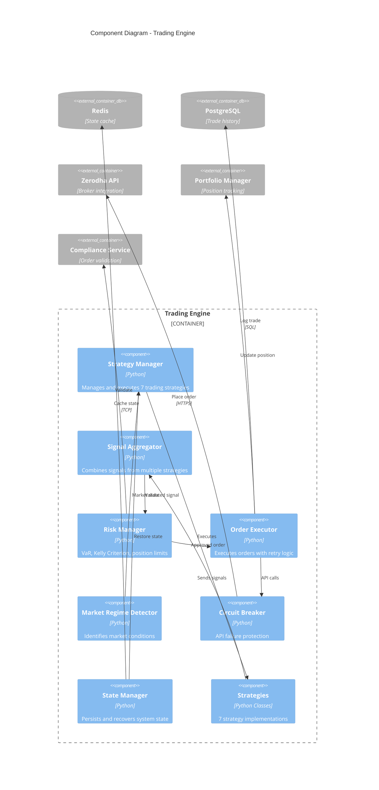

# Trading System - C4 Component Diagram

**Level 3: Component Diagram - Trading Engine**

This diagram zooms into the Trading Engine container and shows its internal components.



---

## Component Details

### 1. Strategy Manager

**File:** `core/trading_system.py` (1,934 lines)

**Purpose:** Orchestrates execution of all trading strategies

**Responsibilities:**
- Initialize 7 trading strategies
- Coordinate strategy execution cycles
- Distribute market data to strategies
- Collect signals from all strategies
- Monitor strategy health and performance

**Strategies Managed:**
1. Moving Average Crossover
2. RSI (Relative Strength Index)
3. Bollinger Bands
4. Volume Breakout
5. Momentum
6. MACD (passive mode)
7. ML Integration (beta)

**Configuration:**
```python
{
    "active_strategies": ["ma", "rsi", "bollinger", "volume", "momentum"],
    "signal_threshold": 0.7,  # Minimum confidence
    "execution_interval": "1m"
}
```

**State:** Maintained in Redis with 30s throttling

---

### 2. Signal Aggregator

**File:** `core/trading_system.py` (SignalAggregator class)

**Purpose:** Combine signals from multiple strategies

**Aggregation Methods:**
1. **Weighted Average:** Each strategy has confidence weight
2. **Voting:** Minimum agreement threshold
3. **Priority-based:** Exit signals prioritized

**Configuration:**
```python
{
    "min_agreement": 0.4,  # 40% for paper trading
    "min_agreement_live": 0.6,  # 60% for live trading
    "exit_threshold": 0.3  # Lower threshold for exits
}
```

**Signal Format:**
```python
{
    "action": "BUY" | "SELL" | "HOLD",
    "confidence": 0.0 to 1.0,
    "strategy": "strategy_name",
    "reasons": ["reason1", "reason2"],
    "metadata": {...}
}
```

---

### 3. Risk Manager

**File:** `core/advanced_risk_manager.py`

**Purpose:** Multi-layer risk management

**Risk Checks:**

#### Position Limits
```python
MAX_OPEN_POSITIONS = 20
MAX_TRADES_PER_DAY = 150
MAX_TRADES_PER_SYMBOL_PER_DAY = 8
MAX_SECTOR_EXPOSURE = 6
```

#### Position Sizing
```python
# Kelly Criterion (half-Kelly for safety)
position_size = kelly_fraction * capital * 0.5

# Risk per trade
risk_per_trade = 0.5%  # of portfolio (live)
risk_per_trade = 1.8%  # of portfolio (paper)
```

#### Stop Loss & Take Profit
```python
stop_loss = entry_price - (ATR * 2.0)
take_profit = entry_price + (ATR * 3.0)

# Trailing stop
trailing_stop_activation = entry_price + (ATR * 1.5)
trailing_stop_distance = ATR * 0.8
```

#### Advanced Analytics
- **VaR (Value at Risk):** 95%, 99% confidence levels
- **Sharpe Ratio:** Risk-adjusted returns
- **Max Drawdown:** Portfolio peak-to-trough
- **Correlation Analysis:** Portfolio diversification

---

### 4. Order Executor

**File:** `core/portfolio/mixins/order_execution.py`

**Purpose:** Execute orders with reliability

**Execution Flow:**
```
1. Validate order parameters
2. Check portfolio constraints
3. Calculate transaction costs
4. Place order via broker API
5. Handle order status updates
6. Retry on transient failures
7. Log execution details
```

**Retry Logic:**
```python
max_retries = 3
backoff_factor = 2  # Exponential backoff
timeout = 30s
```

**Order Types Supported:**
- Market orders
- Limit orders
- Stop-loss orders
- Bracket orders

---

### 5. Market Regime Detector

**File:** `core/trading_system.py` (MarketRegimeDetector class)

**Purpose:** Identify current market conditions

**Regimes Detected:**
1. **Trending:** Clear directional movement
2. **Range-Bound:** Sideways movement
3. **Volatile:** High volatility periods
4. **Low Liquidity:** Thin trading volumes

**Indicators Used:**
- ADX (Average Directional Index)
- ATR (Average True Range)
- Volume analysis
- Price volatility

**Strategy Adaptation:**
```python
if regime == "trending":
    enable_momentum_strategies()
elif regime == "range_bound":
    enable_mean_reversion_strategies()
elif regime == "volatile":
    reduce_position_sizes()
    increase_stop_loss_distance()
```

---

### 6. Circuit Breaker

**File:** `api/rate_limiter.py`, `utilities/exception_handler.py`

**Purpose:** Protect against API failures and cascading errors

**Protection Mechanisms:**

#### API Circuit Breaker
```python
failure_threshold = 5  # failures
timeout = 60s  # circuit open duration
half_open_timeout = 30s  # test recovery
```

**States:**
- **CLOSED:** Normal operation
- **OPEN:** Circuit tripped, fail fast
- **HALF-OPEN:** Testing recovery

#### Rate Limiting
```python
rate_limit = 3 requests/second
burst_limit = 5 requests
```

#### Retry Strategy
```python
max_retries = 3
retry_delay = [1s, 2s, 4s]  # Exponential backoff
```

---

### 7. State Manager

**File:** `core/trading_system.py` (State persistence methods)

**Purpose:** Persist and recover trading system state

**State Components:**
1. **Active Positions**
2. **Pending Orders**
3. **Strategy Parameters**
4. **Risk Metrics**
5. **Execution History**

**Persistence Strategy:**
```python
# Throttled writes (avoid excessive I/O)
min_persist_interval = 30s
dirty_flag_tracking = True

# Storage
primary_storage = "state/trading_state.json"
backup_storage = "s3://backups/state/"
cache_storage = "redis://cache/state"
```

**Recovery:**
```python
def recover_state():
    # 1. Try Redis (fastest)
    # 2. Try local file system
    # 3. Try S3 backup
    # 4. Initialize clean state
```

**State Encryption:**
```python
algorithm = "AES-256-GCM"
key_derivation = "PBKDF2"
```

---

## Strategy Components

### Base Strategy Interface

```python
class BaseStrategy(ABC):
    @abstractmethod
    def generate_signal(self, data: pd.DataFrame) -> Signal:
        pass

    @abstractmethod
    def calculate_indicators(self, data: pd.DataFrame) -> dict:
        pass

    @property
    @abstractmethod
    def name(self) -> str:
        pass
```

---

### 1. Moving Average Strategy

**File:** `strategies/moving_average.py`

**Parameters:**
```python
fast_period = 5  # (live), 3 (paper)
slow_period = 15  # (live), 10 (paper)
confidence_threshold = 0.7
```

**Signal Logic:**
```python
if fast_ma > slow_ma and prev_fast_ma <= prev_slow_ma:
    signal = BUY
elif fast_ma < slow_ma and prev_fast_ma >= prev_slow_ma:
    signal = SELL
```

---

### 2. RSI Strategy

**File:** `strategies/rsi.py`

**Parameters:**
```python
period = 7
oversold_level = 25
overbought_level = 75
confidence_threshold = 0.75
```

**Signal Logic:**
```python
if rsi < oversold_level and rsi_trend == "rising":
    signal = BUY  # Oversold bounce
elif rsi > overbought_level and rsi_trend == "falling":
    signal = SELL  # Overbought reversal
```

---

### 3. Bollinger Bands Strategy

**File:** `strategies/bollinger_bands.py`

**Parameters:**
```python
period = 20
std_dev = 2.0
confidence_threshold = 0.7
```

**Signal Logic:**
```python
if price < lower_band and price_trend == "rising":
    signal = BUY  # Price bouncing from lower band
elif price > upper_band and price_trend == "falling":
    signal = SELL  # Price reversing from upper band
```

---

### 4. Volume Breakout Strategy

**File:** `strategies/volume_breakout.py`

**Parameters:**
```python
volume_threshold = 1.3  # 30% above average
lookback_period = 20
confidence_threshold = 0.8
```

**Signal Logic:**
```python
if volume > avg_volume * threshold and price_change > 0:
    signal = BUY  # Volume breakout upwards
elif volume > avg_volume * threshold and price_change < 0:
    signal = SELL  # Volume breakdown
```

---

### 5. Momentum Strategy

**File:** `strategies/momentum.py`

**Parameters:**
```python
momentum_period = 10
signal_period = 7
confidence_threshold = 0.75
```

**Signal Logic:**
```python
momentum = price - price[n_periods_ago]
signal_line = EMA(momentum, signal_period)

if momentum > signal_line and prev_momentum <= prev_signal:
    signal = BUY
elif momentum < signal_line and prev_momentum >= prev_signal:
    signal = SELL
```

---

### 6. MACD Strategy (Passive)

**File:** `strategies/macd.py`

**Status:** Passive mode (signals not used for trading)

**Parameters:**
```python
fast_period = 12
slow_period = 26
signal_period = 9
```

---

### 7. ML Integration Strategy (Beta)

**File:** `core/ml_integration.py`

**Status:** Beta testing

**Model:** Random Forest Classifier

**Features (50+):**
- Price-based (returns, momentum)
- Volume-based (volume ratios)
- Technical indicators (RSI, MACD, Bollinger Bands)
- Volatility metrics (ATR, std dev)

**Prediction:**
```python
prediction = model.predict_proba(features)
if prediction[UP] > 0.85:
    signal = BUY
elif prediction[DOWN] > 0.85:
    signal = SELL
```

---

## Data Flow Within Trading Engine

### Main Execution Loop

```
1. Market Data Arrives
   ↓
2. Market Regime Detector analyzes conditions
   ↓
3. Strategy Manager distributes data to all strategies
   ↓
4. Each strategy calculates indicators
   ↓
5. Each strategy generates signal (BUY/SELL/HOLD)
   ↓
6. Signal Aggregator combines all signals
   ↓
7. Risk Manager validates aggregated signal
   ↓
8. Compliance Service validates order
   ↓
9. Order Executor places order (if approved)
   ↓
10. Circuit Breaker protects API calls
   ↓
11. State Manager persists state
   ↓
12. Portfolio Manager updates positions
```

**Execution Time:** 50-200ms per cycle

---

## Error Handling

### Exception Hierarchy

```python
TradingSystemException
├── DataException
│   ├── MissingDataException
│   ├── StaleDataException
│   └── InvalidDataException
├── OrderException
│   ├── OrderRejectionException
│   ├── InsufficientFundsException
│   └── PositionLimitException
├── APIException
│   ├── RateLimitException
│   ├── AuthenticationException
│   └── NetworkException
└── StateException
    ├── StateCorruptionException
    └── StateRecoveryException
```

### Recovery Strategies

| Exception Type | Recovery Action |
|----------------|----------------|
| DataException | Use cached data, alert if stale > 5min |
| RateLimitException | Backoff and retry, use circuit breaker |
| OrderRejectionException | Log, alert, don't retry |
| StateCorruptionException | Recover from backup, alert critical |
| NetworkException | Retry with exponential backoff |

---

## Performance Metrics

### Strategy Execution

| Metric | Target | Current |
|--------|--------|---------|
| Signal Generation | <100ms | ~50ms |
| Risk Validation | <50ms | ~20ms |
| Order Execution | <500ms | ~340ms |
| State Persistence | <1s | ~200ms |

### Resource Usage

| Component | CPU | Memory |
|-----------|-----|--------|
| Strategy Manager | 200m | 256Mi |
| Signal Aggregator | 50m | 64Mi |
| Risk Manager | 100m | 128Mi |
| Order Executor | 100m | 64Mi |
| **Total** | **500m** | **512Mi** |

---

## Configuration

### Environment Variables

```bash
# Trading Mode
TRADING_MODE=live|paper|backtest

# Risk Limits
MAX_OPEN_POSITIONS=20
MAX_TRADES_PER_DAY=150
MAX_POSITION_SIZE_PCT=15

# Strategy Config
ACTIVE_STRATEGIES=ma,rsi,bollinger,volume,momentum
MIN_SIGNAL_CONFIDENCE=0.7

# State Persistence
STATE_PERSIST_INTERVAL=30
STATE_BACKUP_ENABLED=true
```

### Strategy Configuration File

```json
{
  "strategies": {
    "moving_average": {
      "enabled": true,
      "fast_period": 5,
      "slow_period": 15,
      "confidence_threshold": 0.7
    },
    "rsi": {
      "enabled": true,
      "period": 7,
      "oversold": 25,
      "overbought": 75,
      "confidence_threshold": 0.75
    }
  }
}
```

---

## Testing

### Unit Tests

```python
# tests/test_trading_engine.py
test_strategy_signal_generation()
test_signal_aggregation()
test_risk_validation()
test_order_execution()
test_state_persistence()
test_circuit_breaker()
```

### Integration Tests

```python
# tests/integration/test_trading_flow.py
test_end_to_end_buy_flow()
test_end_to_end_sell_flow()
test_error_recovery()
test_state_recovery()
```

### Coverage: 85%+

---

## Monitoring & Observability

### Metrics Exported

```python
# Prometheus metrics
trading_signals_generated_total
trading_orders_executed_total{status="success|failed"}
trading_strategy_execution_duration_seconds
trading_risk_checks_total{result="approved|rejected"}
trading_circuit_breaker_state{state="open|closed|half_open"}
trading_active_positions
trading_portfolio_value_usd
```

### Logs

```json
{
  "timestamp": "2025-11-01T10:30:00Z",
  "level": "INFO",
  "component": "trading_engine",
  "action": "order_executed",
  "symbol": "RELIANCE",
  "side": "BUY",
  "quantity": 100,
  "price": 2450.50,
  "confidence": 0.82
}
```

---

**Document Version:** 1.0
**Last Updated:** November 2025
**Author:** Engineering Team
**Review Cycle:** Monthly
