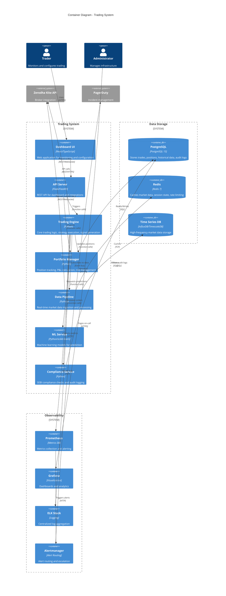

# Trading System - C4 Container Diagram

**Level 2: Container Diagram**

This diagram zooms into the trading system and shows the high-level technical building blocks (containers: applications, data stores, microservices).



---

## Container Details

### 1. Dashboard UI

**Technology:** React 18, TypeScript, Chart.js, WebSocket

**Purpose:** Interactive web interface for traders and administrators

**Key Features:**
- Real-time portfolio monitoring
- Live P&L tracking
- Strategy configuration
- Trade history viewer
- Performance analytics
- Risk metrics dashboard

**Deployment:**
- Docker container
- Served by Nginx
- Port: 8080 (internal), 443 (external via ingress)

**Scaling:** 2-5 replicas behind load balancer

---

### 2. API Server

**Technology:** Flask 3.0 / FastAPI, Python 3.10+

**Purpose:** REST API for dashboard and external integrations

**Endpoints:**
- `/api/v1/positions` - Portfolio positions
- `/api/v1/orders` - Order history
- `/api/v1/strategies` - Strategy management
- `/api/v1/health` - Health check
- `/api/v1/metrics` - Performance metrics

**Authentication:** JWT tokens, API keys

**Rate Limiting:** 100 requests/minute per client

**Deployment:** Port 5000 (internal)

---

### 3. Trading Engine

**Technology:** Python 3.10+, asyncio

**Purpose:** Core trading logic and strategy execution

**Components:**
- Strategy Manager (7 strategies)
- Signal Aggregator
- Order Executor
- Risk Manager
- Market Regime Detector

**Key Responsibilities:**
1. Execute trading strategies
2. Generate buy/sell signals
3. Validate against risk limits
4. Place orders via broker API
5. Handle order lifecycle

**State Management:** Redis for distributed state

**Threads:** Main event loop + background workers

---

### 4. Portfolio Manager

**Technology:** Python 3.10+, pandas, numpy

**Purpose:** Position and portfolio management

**Key Responsibilities:**
1. Track all open positions
2. Calculate real-time P&L
3. Synchronize with broker positions
4. Transaction cost modeling
5. Performance attribution

**Mixins:**
- OrderExecutionMixin
- ComplianceMixin
- DashboardSyncMixin

**Data Model:**
```python
Position {
    symbol: str
    quantity: int
    entry_price: float
    current_price: float
    pnl: float
    unrealized_pnl: float
}
```

---

### 5. Data Pipeline

**Technology:** Python 3.10+, websocket-client, pandas

**Purpose:** Real-time market data ingestion

**Data Sources:**
- Live quotes (WebSocket)
- Historical OHLCV data
- Order book data
- Tick data

**Processing:**
1. Normalize data format
2. Calculate technical indicators
3. Detect anomalies
4. Cache in Redis
5. Store in time-series DB

**Throughput:** 10,000+ ticks/second

---

### 6. ML Service

**Technology:** Python 3.10+, scikit-learn, TensorFlow

**Purpose:** Machine learning predictions

**Models:**
- Random Forest Classifier (primary)
- LSTM for price prediction (beta)
- Sentiment analysis (planned)

**Features:**
- Technical indicators (50+)
- Price patterns
- Volume analysis
- Market microstructure

**Inference:** <100ms latency

**Model Updates:** Weekly retraining

---

### 7. Compliance Service

**Technology:** Python 3.10+

**Purpose:** Regulatory compliance and auditing

**Checks:**
- SEBI order validation
- Wash trading detection
- Front-running prevention
- Position limit monitoring
- Market manipulation detection

**Audit Trail:**
- All orders (5-year retention)
- Trade executions
- Risk events
- Compliance violations

---

## Data Stores

### PostgreSQL Database

**Version:** 15.x
**Deployment:** Primary + 2 replicas

**Schema:**
- `trades` - All executed trades
- `orders` - Order history
- `positions` - Position snapshots
- `audit_logs` - Compliance and security events
- `strategies` - Strategy configurations
- `users` - User accounts and permissions

**Backup:** Daily full backup, 30-day retention

**Performance:**
- Connection pool: 2-10 connections
- Query timeout: 30s
- Indexed queries: <50ms p95

---

### Redis Cache

**Version:** 7.x
**Deployment:** Master + 2 replicas + Sentinel (3 nodes)

**Use Cases:**
1. **Market Data Cache:** LRU, 60s TTL, 1000 items
2. **Session State:** User sessions, JWT tokens
3. **Rate Limiting:** Token bucket counters
4. **Distributed Locks:** For state synchronization

**Memory:** 512MB (configurable)

**Eviction:** allkeys-lru

---

### Time Series Database

**Options:** InfluxDB 2.x or TimescaleDB (PostgreSQL extension)

**Purpose:** High-frequency market data storage

**Data:**
- Tick data (100K+ points/day)
- 1-minute OHLCV
- Volume data
- Order book snapshots

**Retention:**
- Raw ticks: 7 days
- 1-minute bars: 1 year
- 1-hour bars: 5 years

---

## Observability Stack

### Prometheus

**Purpose:** Metrics collection and alerting

**Metrics Collected:**
- Trading system metrics (25+ custom metrics)
- Infrastructure metrics (CPU, memory, disk)
- Application metrics (requests, latency, errors)
- Business metrics (trades, P&L, positions)

**Scrape Interval:** 15s

**Retention:** 30 days

---

### Grafana

**Purpose:** Visualization and dashboards

**Dashboards (5):**
1. Trading Activity - Live trading metrics
2. Performance Metrics - Latency, throughput
3. System Health - Infrastructure status
4. Business Analytics - P&L, risk metrics
5. Alert Management - Active alerts

**Users:** 10+ concurrent

---

### ELK Stack

**Components:**
- Elasticsearch: Log storage and search
- Logstash: Log processing pipeline
- Kibana: Log visualization

**Log Volume:** ~500MB/day

**Retention:** 90 days

**Search:** Full-text search on all logs

---

### Alertmanager

**Purpose:** Alert routing and escalation

**Integrations:**
- PagerDuty for critical alerts
- Slack for team notifications
- Email for informational alerts

**Alert Rules:** 50+ rules configured

---

## Communication Patterns

### Synchronous Communication (REST)

```
Dashboard → API Server → Trading Engine
```
- Request/response pattern
- Timeout: 30s
- Retry: 3 attempts with exponential backoff

---

### Asynchronous Communication (Events)

```
Data Pipeline → [Event Bus] → Trading Engine
```
- Event-driven architecture
- Loose coupling between components

**Event Types:**
- MarketDataUpdate
- OrderFilled
- PositionChanged
- RiskAlert

---

### WebSocket (Real-time)

```
Zerodha API ← WebSocket → Data Pipeline
Dashboard ← WebSocket → API Server
```
- Bi-directional real-time communication
- Heartbeat every 30s
- Auto-reconnect on failure

---

## Security Architecture

### Network Security

**Layers:**
1. **Ingress Controller:** TLS termination, rate limiting
2. **Service Mesh:** mTLS between services
3. **Network Policies:** Restrict pod-to-pod communication

---

### Authentication & Authorization

**External Users:**
- OAuth 2.0 + 2FA (Zerodha)
- JWT tokens for dashboard
- API keys for programmatic access

**Internal Services:**
- Service accounts
- RBAC policies
- Mutual TLS

---

### Data Protection

**Encryption:**
- At rest: AES-256 (database, backups)
- In transit: TLS 1.3
- Secrets: Kubernetes secrets, encrypted

**Access Control:**
- Principle of least privilege
- Audit logging for all access

---

## Deployment Architecture

### Kubernetes Resources

**Deployments:**
- trading-system: 3 replicas (HPA 2-10)
- dashboard: 2 replicas
- api-server: 2 replicas

**StatefulSets:**
- postgres-primary: 1
- postgres-replica: 2
- redis-master: 1
- redis-replica: 2

**Services:**
- ClusterIP for internal communication
- LoadBalancer for external access

---

### Configuration Management

**ConfigMaps:**
- Application configuration
- Strategy parameters
- Feature flags

**Secrets:**
- API keys
- Database passwords
- TLS certificates

---

## Data Flow Examples

### Example 1: Place Order Flow

```
1. User clicks "Buy" on Dashboard
2. Dashboard → API Server: POST /api/v1/orders
3. API Server → Trading Engine: place_order()
4. Trading Engine → Compliance Service: validate_order()
5. Compliance Service → PostgreSQL: check_limits()
6. Trading Engine → Portfolio Manager: check_risk()
7. Trading Engine → Zerodha API: place_order()
8. Zerodha API → NSE: execute order
9. Trading Engine → PostgreSQL: save_order()
10. Trading Engine → Dashboard: order_update (WebSocket)
```

**Latency:** ~300-500ms end-to-end

---

### Example 2: Market Data Ingestion

```
1. Zerodha API → Data Pipeline: tick data (WebSocket)
2. Data Pipeline: normalize_data()
3. Data Pipeline → Redis: cache_price()
4. Data Pipeline → TimeSeries DB: store_tick()
5. Data Pipeline → Trading Engine: publish_event()
6. Trading Engine: evaluate_strategies()
7. Trading Engine → ML Service: get_prediction()
8. ML Service → Trading Engine: prediction result
9. Trading Engine: generate_signal()
```

**Latency:** <50ms for data ingestion, <200ms for full cycle

---

### Example 3: Alert Flow

```
1. Trading System → Prometheus: export_metric()
2. Prometheus: evaluate_alert_rules()
3. Prometheus → Alertmanager: trigger_alert()
4. Alertmanager: route_alert() (check severity)
5. Alertmanager → PagerDuty: send_page() (if critical)
6. Alertmanager → Slack: send_notification()
7. Alertmanager → Email: send_email()
8. On-Call Engineer: acknowledge_alert()
```

**Latency:** <1 minute for critical alerts

---

## Performance Characteristics

### Throughput

| Container | Throughput | Notes |
|-----------|------------|-------|
| Trading Engine | 50-150 orders/day | Configurable limits |
| Data Pipeline | 10K ticks/sec | WebSocket stream |
| API Server | 1000 req/sec | With caching |
| Portfolio Manager | 100 position updates/sec | In-memory processing |

### Latency

| Operation | P50 | P95 | P99 |
|-----------|-----|-----|-----|
| API Request | 50ms | 150ms | 300ms |
| Order Execution | 200ms | 400ms | 600ms |
| Market Data Update | 10ms | 30ms | 50ms |
| Database Query | 20ms | 50ms | 100ms |

---

## Resource Requirements

### CPU & Memory

| Container | CPU Request | CPU Limit | Memory Request | Memory Limit |
|-----------|-------------|-----------|----------------|--------------|
| Trading Engine | 500m | 2000m | 512Mi | 2Gi |
| Portfolio Manager | 500m | 1000m | 512Mi | 2Gi |
| Data Pipeline | 250m | 1000m | 256Mi | 1Gi |
| Dashboard | 100m | 500m | 128Mi | 512Mi |
| API Server | 250m | 1000m | 256Mi | 1Gi |

**Total:** ~2 CPU cores, 4-8GB RAM for full stack

---

## Disaster Recovery

### RPO (Recovery Point Objective): 1 hour
### RTO (Recovery Time Objective): 15 minutes

**Backup Strategy:**
- Database: Daily full backup
- Redis: AOF persistence
- State files: Continuous sync to S3

**Failover:**
- PostgreSQL: Automatic failover to replica
- Redis: Sentinel-managed failover
- Application: Rolling restart (zero downtime)

---

**Document Version:** 1.0
**Last Updated:** November 2025
**Author:** SRE Team
**Review Cycle:** Quarterly
